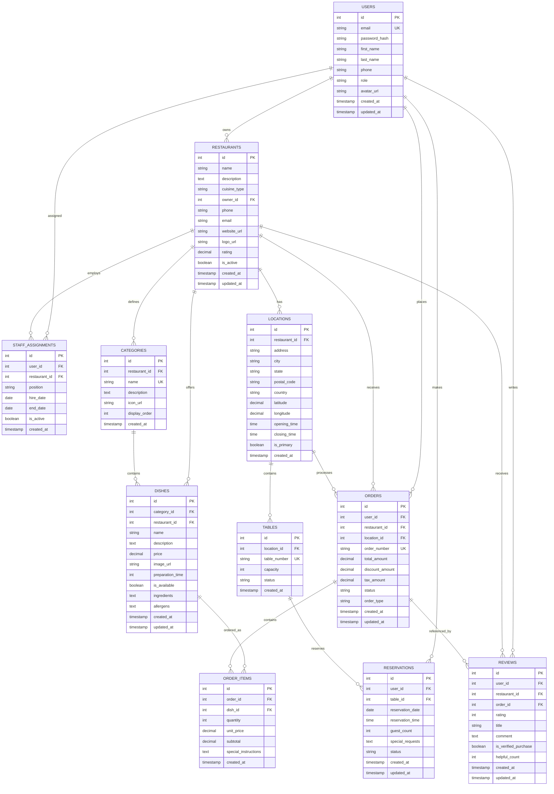

# Modelo de Datos Relacional - Dominio Restaurantes

## 1. Descripción General

Modelo relacional diseñado para gestionar operaciones completas en plataformas de restaurantes, incluyendo:

- Gestión de restaurantes y ubicaciones
- Administración de usuarios (clientes, staff)
- Catálogo de menús y platos
- Sistema de órdenes/pedidos
- Reservas y mesas
- Reseñas y calificaciones

---

## 2. Entidades y Esquema

### 2.1 Tabla: `users`

Gestiona clientes y personal del sistema.

```sql
CREATE TABLE users (
  id SERIAL PRIMARY KEY,
  email VARCHAR(255) UNIQUE NOT NULL,
  password_hash VARCHAR(255) NOT NULL,
  first_name VARCHAR(100) NOT NULL,
  last_name VARCHAR(100) NOT NULL,
  phone VARCHAR(20),
  role VARCHAR(50) NOT NULL DEFAULT 'customer',
    CONSTRAINT role_check CHECK (role IN ('customer', 'staff', 'admin'))
  avatar_url TEXT,
  created_at TIMESTAMP DEFAULT CURRENT_TIMESTAMP,
  updated_at TIMESTAMP DEFAULT CURRENT_TIMESTAMP
);

CREATE INDEX idx_users_email ON users(email);
CREATE INDEX idx_users_role ON users(role);
```

**Atributos:**

- `id`: Identificador único
- `email`: Correo único del usuario
- `password_hash`: Hash seguro de contraseña
- `first_name`, `last_name`: Nombre completo
- `phone`: Teléfono de contacto
- `role`: Tipo de usuario (customer, staff, admin)
- `avatar_url`: Foto de perfil
- `created_at`, `updated_at`: Auditoría temporal

---

### 2.2 Tabla: `restaurants`

Información de los restaurantes.

```sql
CREATE TABLE restaurants (
  id SERIAL PRIMARY KEY,
  name VARCHAR(255) NOT NULL,
  description TEXT,
  cuisine_type VARCHAR(100),
  owner_id INTEGER NOT NULL,
  phone VARCHAR(20),
  email VARCHAR(255),
  website_url TEXT,
  logo_url TEXT,
  rating DECIMAL(3, 2) DEFAULT 0.00,
    CONSTRAINT rating_check CHECK (rating >= 0 AND rating <= 5)
  is_active BOOLEAN DEFAULT TRUE,
  created_at TIMESTAMP DEFAULT CURRENT_TIMESTAMP,
  updated_at TIMESTAMP DEFAULT CURRENT_TIMESTAMP,
  FOREIGN KEY (owner_id) REFERENCES users(id) ON DELETE SET NULL
);

CREATE INDEX idx_restaurants_name ON restaurants(name);
CREATE INDEX idx_restaurants_owner_id ON restaurants(owner_id);
CREATE INDEX idx_restaurants_is_active ON restaurants(is_active);
```

**Atributos:**

- `id`: Identificador único del restaurante
- `name`: Nombre del restaurante
- `description`: Descripción del establecimiento
- `cuisine_type`: Tipo de cocina (mexicana, italiana, etc.)
- `owner_id`: Referencia al propietario (FK → users)
- `phone`, `email`: Contacto del restaurante
- `website_url`: Sitio web del restaurante
- `logo_url`: Logotipo del establecimiento
- `rating`: Calificación promedio (0-5)
- `is_active`: Estado operativo

---

### 2.3 Tabla: `locations`

Múltiples ubicaciones por restaurante.

```sql
CREATE TABLE locations (
  id SERIAL PRIMARY KEY,
  restaurant_id INTEGER NOT NULL,
  address VARCHAR(255) NOT NULL,
  city VARCHAR(100) NOT NULL,
  state VARCHAR(100),
  postal_code VARCHAR(20),
  country VARCHAR(100) DEFAULT 'Mexico',
  latitude DECIMAL(10, 8),
  longitude DECIMAL(11, 8),
  opening_time TIME,
  closing_time TIME,
  is_primary BOOLEAN DEFAULT FALSE,
  created_at TIMESTAMP DEFAULT CURRENT_TIMESTAMP,
  FOREIGN KEY (restaurant_id) REFERENCES restaurants(id) ON DELETE CASCADE
);

CREATE INDEX idx_locations_restaurant_id ON locations(restaurant_id);
CREATE INDEX idx_locations_coordinates ON locations(latitude, longitude);
```

**Atributos:**

- `id`: Identificador de ubicación
- `restaurant_id`: Restaurante asociado (FK → restaurants)
- `address`: Dirección completa
- `city`, `state`, `postal_code`, `country`: Localización geográfica
- `latitude`, `longitude`: Coordenadas GPS
- `opening_time`, `closing_time`: Horario de operación
- `is_primary`: Ubicación principal del restaurante

---

### 2.4 Tabla: `categories`

Categorías de platos en el menú.

```sql
CREATE TABLE categories (
  id SERIAL PRIMARY KEY,
  restaurant_id INTEGER NOT NULL,
  name VARCHAR(100) NOT NULL,
  description TEXT,
  icon_url TEXT,
  display_order INTEGER DEFAULT 0,
  created_at TIMESTAMP DEFAULT CURRENT_TIMESTAMP,
  FOREIGN KEY (restaurant_id) REFERENCES restaurants(id) ON DELETE CASCADE,
  CONSTRAINT unique_category_per_restaurant UNIQUE (restaurant_id, name)
);

CREATE INDEX idx_categories_restaurant_id ON categories(restaurant_id);
```

**Atributos:**

- `id`: Identificador de categoría
- `restaurant_id`: Restaurante propietario (FK → restaurants)
- `name`: Nombre de la categoría (Entradas, Platos Principales, etc.)
- `description`: Descripción de la categoría
- `icon_url`: Icono visual
- `display_order`: Orden de visualización en el menú

---

### 2.5 Tabla: `dishes`

Platos del menú de los restaurantes.

```sql
CREATE TABLE dishes (
  id SERIAL PRIMARY KEY,
  category_id INTEGER NOT NULL,
  restaurant_id INTEGER NOT NULL,
  name VARCHAR(255) NOT NULL,
  description TEXT,
  price DECIMAL(10, 2) NOT NULL,
    CONSTRAINT price_check CHECK (price > 0)
  image_url TEXT,
  preparation_time INTEGER,
  is_available BOOLEAN DEFAULT TRUE,
  ingredients TEXT,
  allergens TEXT,
  created_at TIMESTAMP DEFAULT CURRENT_TIMESTAMP,
  updated_at TIMESTAMP DEFAULT CURRENT_TIMESTAMP,
  FOREIGN KEY (category_id) REFERENCES categories(id) ON DELETE CASCADE,
  FOREIGN KEY (restaurant_id) REFERENCES restaurants(id) ON DELETE CASCADE
);

CREATE INDEX idx_dishes_category_id ON dishes(category_id);
CREATE INDEX idx_dishes_restaurant_id ON dishes(restaurant_id);
CREATE INDEX idx_dishes_is_available ON dishes(is_available);
```

**Atributos:**

- `id`: Identificador del plato
- `category_id`: Categoría a la que pertenece (FK → categories)
- `restaurant_id`: Restaurante propietario (FK → restaurants)
- `name`: Nombre del plato
- `description`: Descripción culinaria
- `price`: Precio unitario
- `image_url`: Fotografía del plato
- `preparation_time`: Tiempo de preparación en minutos
- `is_available`: Disponibilidad en tiempo real
- `ingredients`: Lista de ingredientes
- `allergens`: Información de alérgenos

---

### 2.6 Tabla: `tables`

Mesas disponibles en una ubicación.

```sql
CREATE TABLE tables (
  id SERIAL PRIMARY KEY,
  location_id INTEGER NOT NULL,
  table_number VARCHAR(50) NOT NULL,
  capacity INTEGER NOT NULL,
    CONSTRAINT capacity_check CHECK (capacity > 0 AND capacity <= 20)
  status VARCHAR(50) DEFAULT 'available',
    CONSTRAINT status_check CHECK (status IN ('available', 'occupied', 'reserved', 'maintenance'))
  created_at TIMESTAMP DEFAULT CURRENT_TIMESTAMP,
  FOREIGN KEY (location_id) REFERENCES locations(id) ON DELETE CASCADE,
  CONSTRAINT unique_table_per_location UNIQUE (location_id, table_number)
);

CREATE INDEX idx_tables_location_id ON tables(location_id);
CREATE INDEX idx_tables_status ON tables(status);
```

**Atributos:**

- `id`: Identificador de mesa
- `location_id`: Ubicación donde está la mesa (FK → locations)
- `table_number`: Número o identificador de la mesa
- `capacity`: Capacidad de comensales
- `status`: Estado actual (available, occupied, reserved, maintenance)

---

### 2.7 Tabla: `reservations`

Sistema de reservas.

```sql
CREATE TABLE reservations (
  id SERIAL PRIMARY KEY,
  user_id INTEGER NOT NULL,
  table_id INTEGER NOT NULL,
  reservation_date DATE NOT NULL,
  reservation_time TIME NOT NULL,
  guest_count INTEGER NOT NULL,
  special_requests TEXT,
  status VARCHAR(50) DEFAULT 'confirmed',
    CONSTRAINT status_check CHECK (status IN ('pending', 'confirmed', 'cancelled', 'completed'))
  created_at TIMESTAMP DEFAULT CURRENT_TIMESTAMP,
  updated_at TIMESTAMP DEFAULT CURRENT_TIMESTAMP,
  FOREIGN KEY (user_id) REFERENCES users(id) ON DELETE CASCADE,
  FOREIGN KEY (table_id) REFERENCES tables(id) ON DELETE CASCADE
);

CREATE INDEX idx_reservations_user_id ON reservations(user_id);
CREATE INDEX idx_reservations_table_id ON reservations(table_id);
CREATE INDEX idx_reservations_reservation_date ON reservations(reservation_date);
CREATE INDEX idx_reservations_status ON reservations(status);
```

**Atributos:**

- `id`: Identificador de reserva
- `user_id`: Cliente que realiza la reserva (FK → users)
- `table_id`: Mesa reservada (FK → tables)
- `reservation_date`: Fecha de la reserva
- `reservation_time`: Hora de la reserva
- `guest_count`: Número de comensales
- `special_requests`: Solicitudes especiales
- `status`: Estado de la reserva (pending, confirmed, cancelled, completed)

---

### 2.8 Tabla: `orders`

Órdenes de comida.

```sql
CREATE TABLE orders (
  id SERIAL PRIMARY KEY,
  user_id INTEGER NOT NULL,
  restaurant_id INTEGER NOT NULL,
  location_id INTEGER NOT NULL,
  order_number VARCHAR(50) UNIQUE NOT NULL,
  total_amount DECIMAL(10, 2) NOT NULL,
    CONSTRAINT total_check CHECK (total_amount >= 0)
  discount_amount DECIMAL(10, 2) DEFAULT 0.00,
  tax_amount DECIMAL(10, 2) DEFAULT 0.00,
  status VARCHAR(50) DEFAULT 'pending',
    CONSTRAINT status_check CHECK (status IN ('pending', 'confirmed', 'preparing', 'ready', 'delivered', 'cancelled'))
  order_type VARCHAR(50) NOT NULL,
    CONSTRAINT order_type_check CHECK (order_type IN ('dine-in', 'takeout', 'delivery'))
  created_at TIMESTAMP DEFAULT CURRENT_TIMESTAMP,
  updated_at TIMESTAMP DEFAULT CURRENT_TIMESTAMP,
  FOREIGN KEY (user_id) REFERENCES users(id) ON DELETE CASCADE,
  FOREIGN KEY (restaurant_id) REFERENCES restaurants(id) ON DELETE CASCADE,
  FOREIGN KEY (location_id) REFERENCES locations(id) ON DELETE CASCADE
);

CREATE INDEX idx_orders_user_id ON orders(user_id);
CREATE INDEX idx_orders_restaurant_id ON orders(restaurant_id);
CREATE INDEX idx_orders_status ON orders(status);
CREATE INDEX idx_orders_created_at ON orders(created_at DESC);
```

**Atributos:**

- `id`: Identificador de orden
- `user_id`: Cliente que ordena (FK → users)
- `restaurant_id`: Restaurante que atiende (FK → restaurants)
- `location_id`: Ubicación de atención (FK → locations)
- `order_number`: Número secuencial único de orden
- `total_amount`: Monto total
- `discount_amount`: Descuentos aplicados
- `tax_amount`: Impuestos
- `status`: Estado de la orden
- `order_type`: Tipo de servicio (dine-in, takeout, delivery)

---

### 2.9 Tabla: `order_items`

Items individuales en una orden.

```sql
CREATE TABLE order_items (
  id SERIAL PRIMARY KEY,
  order_id INTEGER NOT NULL,
  dish_id INTEGER NOT NULL,
  quantity INTEGER NOT NULL,
    CONSTRAINT quantity_check CHECK (quantity > 0)
  unit_price DECIMAL(10, 2) NOT NULL,
  subtotal DECIMAL(10, 2) NOT NULL,
  special_instructions TEXT,
  created_at TIMESTAMP DEFAULT CURRENT_TIMESTAMP,
  FOREIGN KEY (order_id) REFERENCES orders(id) ON DELETE CASCADE,
  FOREIGN KEY (dish_id) REFERENCES dishes(id) ON DELETE RESTRICT
);

CREATE INDEX idx_order_items_order_id ON order_items(order_id);
CREATE INDEX idx_order_items_dish_id ON order_items(dish_id);
```

**Atributos:**

- `id`: Identificador del item
- `order_id`: Orden a la que pertenece (FK → orders)
- `dish_id`: Plato ordenado (FK → dishes)
- `quantity`: Cantidad de porciones
- `unit_price`: Precio unitario al momento de la orden
- `subtotal`: Precio total del item
- `special_instructions`: Instrucciones especiales de preparación

---

### 2.10 Tabla: `reviews`

Sistema de reseñas y calificaciones.

```sql
CREATE TABLE reviews (
  id SERIAL PRIMARY KEY,
  user_id INTEGER NOT NULL,
  restaurant_id INTEGER NOT NULL,
  order_id INTEGER,
  rating INTEGER NOT NULL,
    CONSTRAINT rating_check CHECK (rating >= 1 AND rating <= 5)
  title VARCHAR(255),
  comment TEXT,
  is_verified_purchase BOOLEAN DEFAULT FALSE,
  helpful_count INTEGER DEFAULT 0,
  created_at TIMESTAMP DEFAULT CURRENT_TIMESTAMP,
  updated_at TIMESTAMP DEFAULT CURRENT_TIMESTAMP,
  FOREIGN KEY (user_id) REFERENCES users(id) ON DELETE CASCADE,
  FOREIGN KEY (restaurant_id) REFERENCES restaurants(id) ON DELETE CASCADE,
  FOREIGN KEY (order_id) REFERENCES orders(id) ON DELETE SET NULL
);

CREATE INDEX idx_reviews_restaurant_id ON reviews(restaurant_id);
CREATE INDEX idx_reviews_user_id ON reviews(user_id);
CREATE INDEX idx_reviews_rating ON reviews(rating);
CREATE INDEX idx_reviews_created_at ON reviews(created_at DESC);
```

**Atributos:**

- `id`: Identificador de reseña
- `user_id`: Autor de la reseña (FK → users)
- `restaurant_id`: Restaurante evaluado (FK → restaurants)
- `order_id`: Orden asociada (FK → orders, opcional)
- `rating`: Calificación de 1 a 5 estrellas
- `title`: Título de la reseña
- `comment`: Texto de la reseña
- `is_verified_purchase`: Validación de compra verificada
- `helpful_count`: Contador de votos útiles

---

### 2.11 Tabla: `staff_assignments`

Asignación de personal a restaurantes.

```sql
CREATE TABLE staff_assignments (
  id SERIAL PRIMARY KEY,
  user_id INTEGER NOT NULL,
  restaurant_id INTEGER NOT NULL,
  position VARCHAR(100) NOT NULL,
  hire_date DATE NOT NULL,
  end_date DATE,
  is_active BOOLEAN DEFAULT TRUE,
  created_at TIMESTAMP DEFAULT CURRENT_TIMESTAMP,
  FOREIGN KEY (user_id) REFERENCES users(id) ON DELETE CASCADE,
  FOREIGN KEY (restaurant_id) REFERENCES restaurants(id) ON DELETE CASCADE,
  CONSTRAINT unique_staff_restaurant UNIQUE (user_id, restaurant_id, hire_date)
);

CREATE INDEX idx_staff_assignments_restaurant_id ON staff_assignments(restaurant_id);
CREATE INDEX idx_staff_assignments_user_id ON staff_assignments(user_id);
CREATE INDEX idx_staff_assignments_is_active ON staff_assignments(is_active);
```

**Atributos:**

- `id`: Identificador de asignación
- `user_id`: Empleado asignado (FK → users)
- `restaurant_id`: Restaurante destino (FK → restaurants)
- `position`: Puesto del empleado
- `hire_date`: Fecha de contratación
- `end_date`: Fecha de finalización (NULL si sigue activo)
- `is_active`: Estado del contrato

---

## 3. Restricciones y Reglas de Negocio

### 3.1 Restricciones Primarias

| Tabla       | Restricción    | Tipo    | Descripción                       |
| ----------- | -------------- | ------- | --------------------------------- |
| users       | email UNIQUE   | única   | Un email por usuario              |
| users       | role IN (..)   | dominio | Solo roles válidos                |
| restaurants | rating 0-5     | rango   | Escala de calificación            |
| locations   | restaurant_id  | FK      | Ubicación pertenece a restaurante |
| dishes      | price > 0      | dominio | Precios positivos                 |
| tables      | capacity 1-20  | rango   | Mesas de 1 a 20 personas          |
| orders      | status IN (..) | dominio | Solo estados válidos              |
| order_items | quantity > 0   | dominio | Cantidad positiva                 |
| reviews     | rating 1-5     | rango   | Escala de 1 a 5 estrellas         |

### 3.2 Integridad Referencial - Reglas Detalladas

#### 3.2.1 Matriz de Claves Foráneas y Acciones

| Tabla | Columna FK | Referencia | ON DELETE | ON UPDATE | Justificación |
|-------|-----------|------------|-----------|-----------|----------------|
| restaurants | owner_id | users(id) | SET NULL | CASCADE | El propietario puede ser eliminado; se desvincula restaurante |
| locations | restaurant_id | restaurants(id) | CASCADE | CASCADE | Ubicación depende del restaurante; se elimina con éste |
| categories | restaurant_id | restaurants(id) | CASCADE | CASCADE | Categoría depende del restaurante; se elimina con éste |
| dishes | category_id | categories(id) | CASCADE | CASCADE | Plato depende de categoría; se elimina con ésta |
| dishes | restaurant_id | restaurants(id) | CASCADE | CASCADE | Plato depende del restaurante; se elimina con éste |
| tables | location_id | locations(id) | CASCADE | CASCADE | Mesa depende de ubicación; se elimina con ésta |
| reservations | user_id | users(id) | CASCADE | CASCADE | Reserva de usuario; se elimina si usuario se borra |
| reservations | table_id | tables(id) | CASCADE | CASCADE | Reserva vinculada a mesa; se elimina si mesa se borra |
| orders | user_id | users(id) | CASCADE | CASCADE | Orden del usuario; se mantiene históricamente (ver 3.2.3) |
| orders | restaurant_id | restaurants(id) | CASCADE | CASCADE | Orden del restaurante; se mantiene históricamente |
| orders | location_id | locations(id) | RESTRICT | RESTRICT | Ubicación de atención; no se puede borrar si hay órdenes |
| order_items | order_id | orders(id) | CASCADE | CASCADE | Item pertenece a orden; se elimina con ésta |
| order_items | dish_id | dishes(id) | RESTRICT | RESTRICT | Plato no puede eliminarse si está en órdenes activas |
| reviews | user_id | users(id) | CASCADE | CASCADE | Reseña del usuario; se elimina si usuario se borra |
| reviews | restaurant_id | restaurants(id) | CASCADE | CASCADE | Reseña del restaurante; se mantiene históricamente (ver 3.2.3) |
| reviews | order_id | orders(id) | SET NULL | RESTRICT | Orden puede desvincularse; referencia opcional |
| staff_assignments | user_id | users(id) | CASCADE | CASCADE | Asignación del empleado; se elimina si empleado se borra |
| staff_assignments | restaurant_id | restaurants(id) | CASCADE | CASCADE | Asignación en restaurante; se elimina con éste |

#### 3.2.2 Estrategias de Acción

**ON DELETE CASCADE** - Eliminación en cascada
- Se utilizan en relaciones de **composición fuerte** (parte-todo)
- Ejemplo: Eliminar un restaurante borra todas sus ubicaciones, categorías y platos
- **Riesgo**: Pérdida masiva de datos; usar con cuidado en operaciones de eliminación
- **Implementación recomendada**: Requerir confirmación del usuario antes de eliminar

**ON DELETE SET NULL** - Desvincular registro
- Se utilizan en relaciones **opcionales** donde la FK puede ser NULL
- Ejemplo: Eliminar propietario desvincula restaurante (propietario = NULL)
- **Riesgo**: Datos huérfanos; se recomienda con FK NULLABLE
- **Implementación**: Solo para referencias no críticas

**ON DELETE RESTRICT** - Prohibir eliminación
- Se utilizan para **proteger datos activos**
- Ejemplo: No se puede eliminar un plato si tiene órdenes pendientes
- **Beneficio**: Preservar integridad de datos históricos
- **Implementación**: Requiere eliminación manual o soft delete

**ON UPDATE CASCADE** - Propagar cambios de clave primaria
- Se utiliza cuando la PK de la tabla referenciada puede cambiar
- En PostgreSQL, típicamente se asigna a CASCADE para consistencia
- **Nota**: Las PK (SERIAL) rara vez cambian en la práctica

#### 3.2.3 Consideraciones de Negocio Críticas

**Auditoría Histórica - Datos que NO deben eliminarse:**

1. **Tabla `orders`**: 
   - Mantener para auditoría fiscal y histórico de ventas
   - Implementar soft delete: agregar columna `deleted_at TIMESTAMP NULL`
   - Queries deben filtrar: `WHERE deleted_at IS NULL`
   - Alternativa: Usar trigger para copiar a tabla de archivo

2. **Tabla `reviews`**:
   - Mantener para reputación y análisis
   - Implementar soft delete: `deleted_at TIMESTAMP NULL`
   - Permitir solo ocultar (flag `is_hidden BOOLEAN`), no eliminar

3. **Tabla `staff_assignments`**:
   - Mantener registro histórico de empleados
   - Usar `end_date` para marcas desvinculación, no DELETE
   - Implementar: `WHERE is_active = TRUE` en queries de staff activo

**Reglas de Integridad Adicionales:**

```sql
-- Trigger: Validar que no haya órdenes pendientes antes de eliminar ubicación
CREATE OR REPLACE FUNCTION validate_location_deletion()
RETURNS TRIGGER AS $$
BEGIN
  IF EXISTS (
    SELECT 1 FROM orders 
    WHERE location_id = OLD.id 
    AND status IN ('pending', 'confirmed', 'preparing', 'ready')
  ) THEN
    RAISE EXCEPTION 'No se puede eliminar ubicación con órdenes activas';
  END IF;
  RETURN OLD;
END;
$$ LANGUAGE plpgsql;

CREATE TRIGGER trg_validate_location_deletion
BEFORE DELETE ON locations
FOR EACH ROW EXECUTE FUNCTION validate_location_deletion();

-- Trigger: Validar disponibilidad de mesa para reserva
CREATE OR REPLACE FUNCTION validate_table_availability()
RETURNS TRIGGER AS $$
BEGIN
  IF EXISTS (
    SELECT 1 FROM reservations 
    WHERE table_id = NEW.table_id
    AND reservation_date = NEW.reservation_date
    AND reservation_time = NEW.reservation_time
    AND status IN ('pending', 'confirmed')
    AND id != NEW.id
  ) THEN
    RAISE EXCEPTION 'Mesa no disponible en esa fecha y hora';
  END IF;
  RETURN NEW;
END;
$$ LANGUAGE plpgsql;

CREATE TRIGGER trg_validate_table_availability
BEFORE INSERT OR UPDATE ON reservations
FOR EACH ROW EXECUTE FUNCTION validate_table_availability();

-- Trigger: Actualizar sum total de orden cuando cambia item
CREATE OR REPLACE FUNCTION update_order_total()
RETURNS TRIGGER AS $$
BEGIN
  UPDATE orders 
  SET total_amount = (
    SELECT SUM(subtotal) FROM order_items WHERE order_id = COALESCE(NEW.order_id, OLD.order_id)
  ),
  updated_at = CURRENT_TIMESTAMP
  WHERE id = COALESCE(NEW.order_id, OLD.order_id);
  RETURN COALESCE(NEW, OLD);
END;
$$ LANGUAGE plpgsql;

CREATE TRIGGER trg_update_order_total
AFTER INSERT OR UPDATE OR DELETE ON order_items
FOR EACH ROW EXECUTE FUNCTION update_order_total();

-- Trigger: Validar que el contador de comensales no exceda capacidad de mesa
CREATE OR REPLACE FUNCTION validate_guest_count()
RETURNS TRIGGER AS $$
DECLARE v_capacity INTEGER;
BEGIN
  SELECT capacity INTO v_capacity 
  FROM tables WHERE id = NEW.table_id;
  
  IF NEW.guest_count > v_capacity THEN
    RAISE EXCEPTION 'Número de comensales (%) excede capacidad de mesa (%)', 
      NEW.guest_count, v_capacity;
  END IF;
  RETURN NEW;
END;
$$ LANGUAGE plpgsql;

CREATE TRIGGER trg_validate_guest_count
BEFORE INSERT OR UPDATE ON reservations
FOR EACH ROW EXECUTE FUNCTION validate_guest_count();
```

#### 3.2.4 Implementación en NestJS/TypeORM

```typescript
// Ejemplo: Relación con estrategia de eliminación

import { Entity, PrimaryGeneratedColumn, ManyToOne, OneToMany, DeleteDateColumn } from 'typeorm';

@Entity('restaurants')
export class Restaurant {
  @PrimaryGeneratedColumn()
  id: number;

  @ManyToOne(() => User, { nullable: true, onDelete: 'SET NULL' })
  owner: User;

  @OneToMany(() => Location, location => location.restaurant, { 
    cascade: ['remove'] // Eliminar ubicaciones con restaurante
  })
  locations: Location[];

  @DeleteDateColumn({ nullable: true })
  deletedAt: Date; // Para soft delete
}

@Entity('orders')
export class Order {
  @PrimaryGeneratedColumn()
  id: number;

  @ManyToOne(() => User, { onDelete: 'CASCADE' })
  user: User;

  @ManyToOne(() => Restaurant, { onDelete: 'CASCADE' })
  restaurant: Restaurant;

  @OneToMany(() => OrderItem, item => item.order, { 
    cascade: ['remove'] // Eliminar items con orden
  })
  items: OrderItem[];

  @DeleteDateColumn({ nullable: true })
  deletedAt: Date; // Para auditoría
}

@Entity('order_items')
export class OrderItem {
  @PrimaryGeneratedColumn()
  id: number;

  @ManyToOne(() => Order, order => order.items, { onDelete: 'CASCADE' })
  order: Order;

  @ManyToOne(() => Dish, { onDelete: 'RESTRICT' })
  dish: Dish; // No se puede borrar plato con órdenes activas
}
```

#### 3.2.5 Validación de Integridad - Script de Verificación

```sql
-- Detectar referencias huérfanas (FK sin PK correspondiente)
SELECT 'restaurants.owner_id' as fk_path, COUNT(*) as orphaned_count
FROM restaurants r
LEFT JOIN users u ON r.owner_id = u.id
WHERE r.owner_id IS NOT NULL AND u.id IS NULL
UNION ALL
SELECT 'locations.restaurant_id', COUNT(*)
FROM locations l
LEFT JOIN restaurants r ON l.restaurant_id = r.id
WHERE r.id IS NULL
UNION ALL
SELECT 'orders.location_id', COUNT(*)
FROM orders o
LEFT JOIN locations l ON o.location_id = l.id
WHERE l.id IS NULL;

-- Auditoría de cambios en FK
CREATE TABLE fk_changes_audit (
  id SERIAL PRIMARY KEY,
  table_name VARCHAR(100),
  fk_column VARCHAR(100),
  old_value INTEGER,
  new_value INTEGER,
  changed_at TIMESTAMP DEFAULT CURRENT_TIMESTAMP,
  changed_by VARCHAR(100)
);

-- Trigger para auditar cambios
CREATE OR REPLACE FUNCTION audit_fk_changes()
RETURNS TRIGGER AS $$
BEGIN
  IF OLD.id != NEW.id OR (OLD.restaurant_id != NEW.restaurant_id) THEN
    INSERT INTO fk_changes_audit (table_name, fk_column, old_value, new_value, changed_by)
    VALUES (TG_TABLE_NAME, TG_ARGV[0], OLD.id, NEW.id, current_user);
  END IF;
  RETURN NEW;
END;
$$ LANGUAGE plpgsql;
```

### 3.3 Índices de Optimización

Índices creados para consultas frecuentes:

- Búsqueda por usuario, email, rol
- Filtrado de restaurantes activos
- Búsquedas geoespaciales
- Consultas de órdenes por estado y fecha
- Consultas de reseñas ordenadas

---

## 4. Relaciones Base de Datos

```
users (1) → (N) restaurants [propietario]
users (1) → (N) reservations [cliente]
users (1) → (N) orders [cliente]
users (1) → (N) reviews [autor]
users (1) → (N) staff_assignments [empleado]

restaurants (1) → (N) locations
restaurants (1) → (N) categories
restaurants (1) → (N) dishes
restaurants (1) → (N) orders
restaurants (1) → (N) reviews
restaurants (1) → (N) staff_assignments

locations (1) → (N) tables
locations (1) → (N) orders

categories (1) → (N) dishes

dishes (1) → (N) order_items

tables (1) → (N) reservations

orders (1) → (N) order_items
orders (0..1) ← (1) reviews [opcional]

reviews (0..1) ← (N) orders [verificación de compra]
```

---

## 5. Diagrama Entidad-Relación (ER)



---

## 6. Flujos de Datos Principales

### 6.1 Flujo de Reserva

```
User → Reservation → Table
        ↓
     Location
        ↓
     Restaurant
```

### 6.2 Flujo de Orden

```
User → Order → OrderItems → Dishes
        ↓         ↓           ↓
     Restaurant  Category  Ingredients/Allergens
```

### 6.3 Flujo de Reseña

```
User → Review → Restaurant
        ↓
     Order (verificación)
```

### 6.4 Flujo de Personal

```
User → StaffAssignment → Restaurant
       (empleado)         (ubicación)
```

---

## 7. Consideraciones de Diseño

### 7.1 Normalización

- **Forma Normal 3 (3NF)**: Todas las tablas están normalizadas para evitar anomalías de inserción, actualización y eliminación
- **No redundancia**: Información única almacenada una sola vez
- **Integridad referencial**: Garantizada mediante FK con estrategias definidas (CASCADE, SET NULL, RESTRICT)
- **Reglas de negocio**: Implementadas mediante triggers y constraints CHECK
- **Auditoría**: Soft deletes en tablas críticas (orders, reviews, staff_assignments)

### 7.2 Rendimiento

- **Índices estratégicos**: En columnas frecuentemente consultadas
- **Particionamiento potencial**: En tabla `orders` y `reviews` por fecha
- **Vistas materializadas**: Para cálculos de rating y estadísticas

### 7.3 Escalabilidad

- **Soft deletes opcionales**: Agregar columna `deleted_at` en tablas críticas
- **Auditoría**: Timestamps en todas las tablas para seguimiento
- **Connection pooling**: Recomendado en NestJS con TypeORM

---

## 8. Queries Comunes

### Órdenes activas por restaurante

```sql
SELECT o.* FROM orders o
WHERE o.restaurant_id = $1
  AND o.status IN ('pending', 'confirmed', 'preparing', 'ready')
ORDER BY o.created_at DESC;
```

### Platos populares (Top 10)

```sql
SELECT d.*, COUNT(oi.id) as times_ordered
FROM dishes d
JOIN order_items oi ON d.id = oi.dish_id
WHERE d.restaurant_id = $1
GROUP BY d.id
ORDER BY times_ordered DESC
LIMIT 10;
```

### Reservas del día

```sql
SELECT r.*, t.table_number, u.first_name, u.last_name
FROM reservations r
JOIN tables t ON r.table_id = t.id
JOIN users u ON r.user_id = u.id
WHERE DATE(r.reservation_date) = CURRENT_DATE
  AND r.status = 'confirmed'
ORDER BY r.reservation_time ASC;
```

### Reseñas de un restaurante

```sql
SELECT r.*, u.first_name, u.last_name, u.avatar_url
FROM reviews r
JOIN users u ON r.user_id = u.id
WHERE r.restaurant_id = $1
  AND r.rating >= $2
ORDER BY r.created_at DESC;
```

---

## 9. Migraciones Recomendadas (NestJS/TypeORM)

Se recomienda crear migraciones secuenciales:

1. `CreateUsersTable`
2. `CreateRestaurantsTable`
3. `CreateLocationsTable`
4. `CreateCategoriesTable`
5. `CreateDishesTable`
6. `CreateTablesTable`
7. `CreateReservationsTable`
8. `CreateOrdersTable`
9. `CreateOrderItemsTable`
10. `CreateReviewsTable`
11. `CreateStaffAssignmentsTable`

---

**Documento generado**: 6 de abril de 2026  
**Versión**: 1.0  
**Autor**: Arquitecto de Datos  
**Estado**: Listo para implementación
